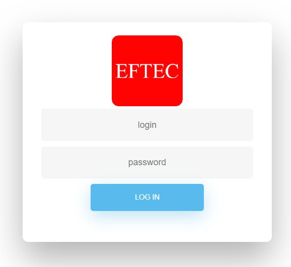
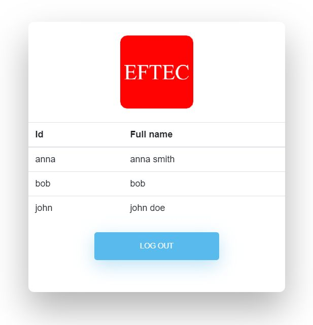

# PdoOne_login
An example of a login page using php and mysql

This example code implements a login page that validates the user into the database. It is a basic example and it lacks some features (such as hash of the password).





## Initializing the project using composer

Run composer as follow

```composer init```

Then, add your information and add the next dependencies: eftec/pdoone,  eftec/bladeone, eftec/validationone  

* eftec/pdoone connects to the database

* eftec/bladeone renders the view

* eftec/validationone validates the user input. It's also a message container.


```composer init


  Welcome to the Composer config generator


This command will guide you through creating your composer.json config.

Package name (<vendor>/<name>) [jorge/pdo-one_login]: eftec/pdoone_login
Description []: example of a login page
Author [<>, n to skip]:
Minimum Stability []:
Package Type (e.g. library, project, metapackage, composer-plugin) []: project
License []: mit

Define your dependencies.

Would you like to define your dependencies (require) interactively [yes]?
Search for a package: eftec/pdoone
Enter the version constraint to require (or leave blank to use the latest version):
Using version ^1.28 for eftec/pdoone
Search for a package: eftec/bladeone
Enter the version constraint to require (or leave blank to use the latest version):
Using version ^3.37 for eftec/bladeone
Search for a package: eftec/validationone
Enter the version constraint to require (or leave blank to use the latest version):
Using version ^1.23 for eftec/validationone
Search for a package:
Would you like to define your dev dependencies (require-dev) interactively [yes]? no

{
    "name": "eftec/pdoone_login",
    "description": "example of a login page",
    "type": "project",
    "require": {
        "eftec/pdoone": "^1.28",
        "eftec/bladeone": "^3.37",
        "eftec/validationone": "^1.23"
    },
    "license": "mit",
    "authors": [
        {
            "name": "",
            "email": ""
        }
    ]
}

Do you confirm generation [yes]?
```

## Edit composer.json

We need to add a default namespace for psr-4. Add the next content inside composer.json

```json
"autoload": {
    "psr-4": {"PdoOne_login\\": ""}
},
```

And runs the next command

```composer dump-autoload```

To rebuild the autoload

## Creating the mysql table

```sql
CREATE TABLE `user` (
  `userid` VARCHAR(50) NOT NULL,
  `password` VARCHAR(60) NULL,
  `fullname` VARCHAR(45) NULL,
  PRIMARY KEY (`userid`));
```

## Generating the class Repo

No, we want to generate the class repository. [repo/UserRepo.php](repo/UserRepo.php) using PdoOne

```shell script
php vendor/eftec/pdoone/lib/PdoOne.php -database mysql -server 127.0.0.1 -user root -pwd abc.123 -db testdb -input "user" -output classcode
```

This connects to a mysql database located in the server 127.0.0.1, user root, password abc.123, database testdb and table "user" (table created in the previous step). It will generate the whole class.

Copy the code and save it inside a new code in a new folder folder called repo

📁 repo

​     📝 UserRepo.php


## Finishing the Class Repo

While the class is complete but it misses a line, the namespace, so let's add the namespace to the class

```php
namespace PdoOne_login\repo;
```

why **PdoOne_login**?  It is because psr-4 (the line added in composer.json)

And **why repo**? It is because the folder is called **repo**.


## Creating the views

📁 views

​     📝 login.blade.php   login template

​     📝 start.blade.php   start template (when we load)

I used the html code form https://bootsnipp.com/tags/login

I edited a bit and here, then I added the notation of Bladeone (check the library for more information)

## Boilerplate code

📁 app

​     📝 app.php  it is our common file

```php
<?php
@session_start();

use eftec\bladeone\BladeOne;
use eftec\PdoOne;
use eftec\ValidationOne;

include __DIR__."/../vendor/autoload.php";


// singleton and container

/** @var BladeOne $bladeOne */
$bladeOne=null;
/** @var PdoOne $pdoOne */
$pdoOne=null;
/** @var ValidationOne $validationOne */
$validationOne=null;

function bladeOne() {
    global $bladeOne;
    if($bladeOne===null) {
        $bladeOne=new BladeOne();
    }
    return $bladeOne;
}
function pdoOne() {
    global $pdoOne;
    if($pdoOne===null) {
        $pdoOne=new PdoOne('mysql','127.0.0.1','root','abc.123','testdb');
        $pdoOne->logLevel=3; // it shows all errors.
        $pdoOne->open();
    }
    return $pdoOne;
}
function validationOne() {
    global $validationOne;
    if($validationOne===null) {
        $validationOne=new ValidationOne();
    }
    return $validationOne;
}
```

What it does?

It creates the instance of PdoOne (database), ValidationOne (validation and message container) and BladeOne (template)

It also starts a new session and enable the composer's autoloader.

The functions are quite simple. The work as : 

* If the variable is not defined, then it is created and initialized.

* And the variable is returned.

  

## Our login code

📝 index.php  it is our login code


```
<?php

use PdoOne_login\repo\UserRepo;

include "app/app.php";

$buttonlogin=validationOne()->type('string')->def(false)->post('buttonlogin');
if($buttonlogin===false) {
    $login='';
    $password='';
} else {
    $login=validationOne()->type('string')
        ->condition('minlen','The login must have at least 3 characters',3)
        ->condition('maxlen','The login must have at most 10 characters',10)
        ->post('login');
    $password=validationOne()->type('string')
        ->condition('minlen','The password must have at least 3 characters',3)
        ->post('password');

    if(validationOne()->messageList->errorcount===0) {
        $userDB= UserRepo::get($login);
        if($userDB===null || $userDB===false || $userDB['password']!=$password) {
            validationOne()->messageList->addItem('general','User or password incorrect','error');
        } else {
            $_SESSION['user']=$userDB;
            session_write_close(); 
            header('location:start.php',true);
            die(1);
        }
    }
}

echo bladeOne()->run('login'
    ,['login'=>$login,
        'password'=>$password]);
```

It works as follow

* if **buttonlogin** is false (not pressed) then
  * It sets some default values (empty user and password)
* If **buttonlogin** is not false then
  * It reads the user and password.
  * If it not fails (it could fail if the user has less than 3 characters or other conditions )
    * We read from the database. We use the **UserRepo** class to read using the primary key.
      * If the user (from the database) is false or if the password (read from the database) is not equals to the input password then
        * It adds an error
      * Otherwise
        * It stores the user in the session
        * Redirect to the login page
* Finally, it shows the template using the library **BladeOne**

## Final testing

We should not forget to add a new user into the database.

Login into our webserver and so we could test it.


## Security

The password is not hash-ed into the database.

How to hash it?

Change the code

```
$userDB['password']!=$password
```

as

```$userDB['password']!= hash('sha256', $password.$SALT)```

where $SALT is a secret value defined in app.php

`$SALT='asdk sk padk se4'3485'4385'¡4reorekkhptrkhptrkhk trhyktrpkptrkh+d+';// It is an example` 

The value must be also store hashed in the database.

